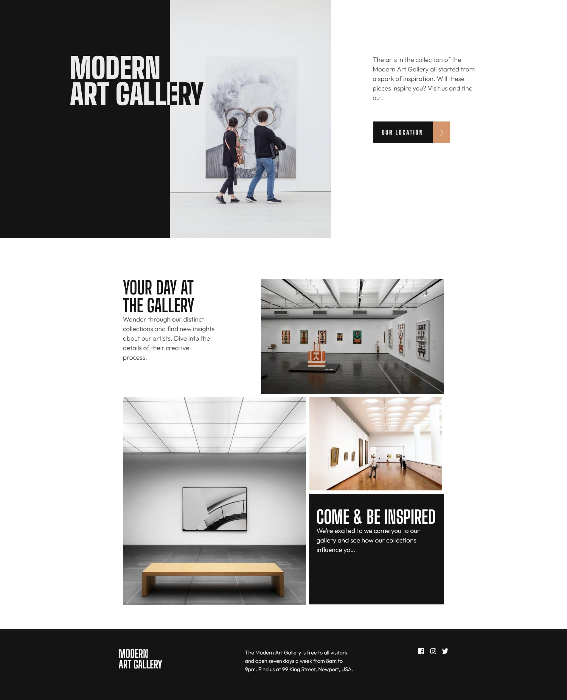
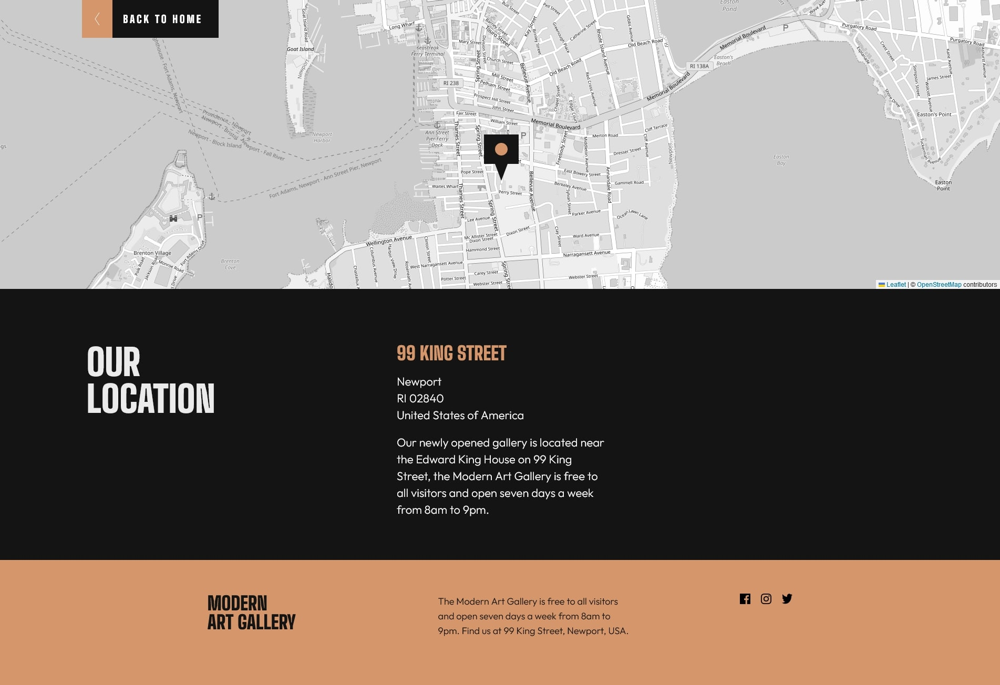

# Frontend Mentor - Art gallery website solution

## Table of contents

- [Overview](#overview)
  - [The challenge](#the-challenge)
  - [Screenshot](#screenshot)
  - [Links](#links)
- [Author](#author)
- [Acknowledgments](#acknowledgments)

## Overview

### The challenge

Users should be able to:

- View the optimal layout for each page depending on their device's screen size
- See hover states for all interactive elements throughout the site
- **Bonus**: Use [Leaflet JS](https://leafletjs.com/) to create an interactive location map with custom location pin

### Screenshot

### Links

- Live Site URL: [Art gallery website](https://ekizashvilit.github.io/art-gallery-website/)

## Author

- LinkedIn - [Teona Ekizashvili](https://www.linkedin.com/in/teona-ekizashvili-ba5725239/)
- Twitter - [@ekizashvilit](https://twitter.com/ekizashvilit)
